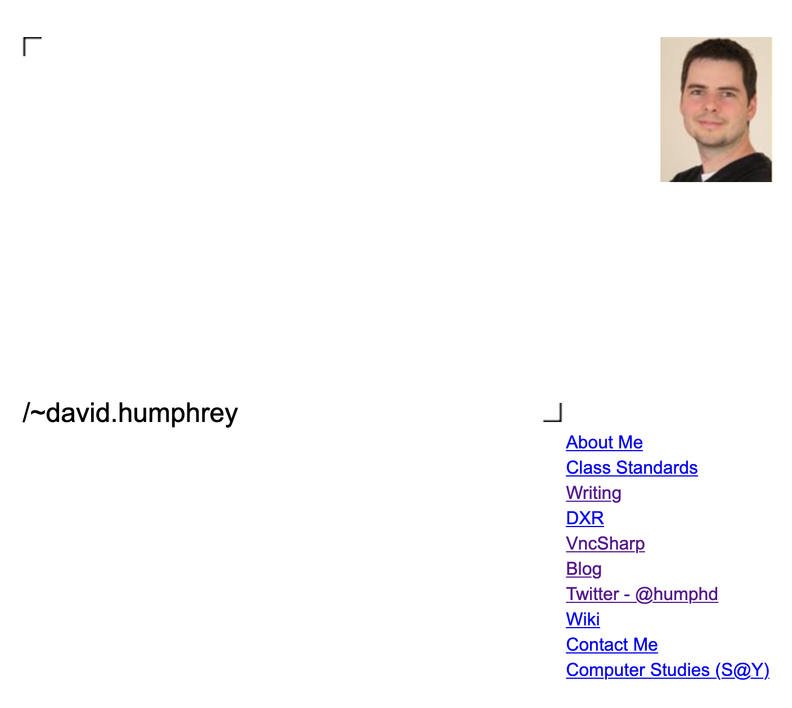

# Old Seneca Writing

Here are some old essays I wrote, pre-blog, when I used to write at https://ict.senecacollege.ca/~david.humphrey/writing/.  Here is what it looked like:

[Wayback machine URL is here](https://web.archive.org/web/20191025191941/https://ict.senecacollege.ca/~david.humphrey/)

When the college took these down, I saved a few here for nostalgia.

1. [Toward a Definition of the Code Poet (2001): My attempt to link Poetry and Programming, and define the central idea behind the Code Poets group.](CodePoet.md)

1. [Ideas on the Loop: the Orbit System (2001): This is an as yet unfinished paper exploring the Loop's philosophical, aesthetic, and technological implications. After discussing what the Loop is, I set-out to define a new "machine" for expressing loops called Orbit. If you'd like to help build this, send me an e-mail](Loop.md)

1. [Agreeing to Open Up: Ideas for Open Source at Seneca (2002): I wrote this paper during the exam period 2002 as a way to express my ideas about how OS could be better integrated at Seneca. I circulated the paper to a number of my colleagues who shared similar ideas. Since writing this, a number of things have happened at Seneca (none of which are directly the result of this paper, but are all in line with what I hoped we could achieve): 1) we have begun an annual Open Source Symposium to discuss and share OS ideas with other college and university faculty; 2) the Centre for the Development of Open Technology (CDOT) has been born. While still in its infancy, the centre has the potential to link the individual OS work going on at Seneca.](OpenSourceSeneca.md)

1. [Open Source at Seneca (2006): After trying to describe what was going on with open source at Seneca to Mike Shaver of Mozilla, I decided to sit down and make a document. It's been nearly five years since I've written on this topic (see above) and a lot has changed. I can't wait to see what we'll have done in another five years.](oss.pdf)
